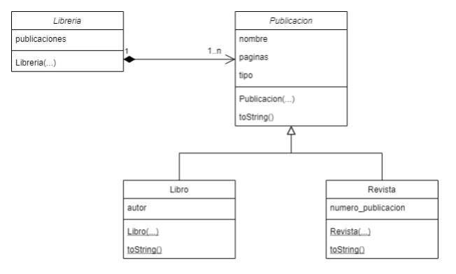

# Reto 2: Librería
La librería mi ávido lector quiere una aplicación para mantener un inventario de las publicaciones disponibles. Todas las publicaciones tienen como atributos nombre, páginas y tipo.

Estas publicaciones se dividen en dos tipos, Libros y Revistas. De los libros se guarda el autor y de las revistas se guarda el número de publicación.

Considere la especificación del siguiente diagrama de clases para este reto:
 

 
## Procesar Comandos

En la clase Librería, se debe definir la función procesar comandos que realiza las siguientes operaciones:

### Opción 1: Agregar contacto

Se puede añadir Libro con el siguiente comando:

```bash
1_nombre_paginas_tipo_autor
```

#### Ejemplo:
```bash
1_La ultima cruzada_106_Libro_carlos Galan
```

Se puede añadir una revista con el siguiente comando:
```bash
1_nombre_paginas_tipo_numeroPublicacion
```

#### Ejemplo:
```
1_El rey Rosado_116_Revista_209
```

### Opción 2: Mostrar contactos de la agenda

Se debe mostrar la frase: `***Publicaciones disponibles***` seguida por las publicaciones en el orden en el que fueron agregadas.

Si se trata de un libro se mostrará así:
```bash
nombre: La ultima cruzada
paginas: 106
tipo: Libro
autor: carlos Galan
```
 
Si se trata de una revista se mostrará así:
```bash
nombre: El rey Rosado
paginas: 116
tipo: Revista
publicacion: #209
```

### Opción 3: Salir

## Notas
- Observe que el único comando que tiene salida es el mostrar.
- En este ejercicio se requiere subir cuatro archivos. 
  - Uno correspondiente a la clase Publicacion llamado `Publicacion.java`
  - otro correspondiente al Libro llamado `Libro.java`
  - otro correspondiente a la Revista llamado `Revista.java`
  - otro correspondiente a la Libreria llamado `Libreria.java` (aquí va el main)
  - Recuerde eliminar la línea de package al hacer el envío y utilizar el botón de `[+]` para agregar más de un archivo de código fuente. 

 

## Ejemplo:

Un ejemplo de ejecución del programa es el siguiente: 

| Entrada                                      | Salida                           |
| -------------------------------------------- | -------------------------------- |
| 1_La ultima cruzada_106_Libro_carlos Galan   |                                  |
| 1_El rey Rosado_116_Revista_209              |                                  |
| 2                                            | \*\*\*Publicaciones disponibles***<br />nombre: La ultima cruzada<br />paginas: 106<br />tipo: Libro<br />autor: carlos Galan<br />nombre: El rey Rosado<br />paginas: 116<br />tipo: Revista<br />publicacion: #209  |
| 3                                            |                                  |
