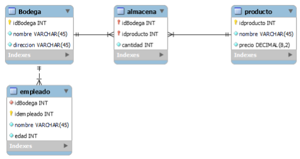

# Reto 4: Bodegas "todo lo bueno"

La empresa distribuidora bodegas todo lo bueno, es un negocio de abastecimiento de productos varios. El CEO de la compañía lo acaba de contratar para realizar una primera implementación de una base de datos que permita administrar los **productos**, **bodegas** y **empleados**. Para realizar esto, se tienen **Productos**, los cuales se almacenan en cajas en una o muchas bodegas. Un Producto tiene un id, un nombre y un precio. Mientras que una Bodega un id, un nombre y una dirección. Adicionalmente, cada bodega tiene empleados (mínimo uno) de los cuales se almacenará el número de identificación, nombre, y su edad. Por ahora, el CEO de la compañía, quiere que usted construya una base de datos en MySQL que permita almacenar la información y relaciones descritas anteriormente. Se adjunta el modelo relacional de la base de datos descrita:



Esto quiere decir que usted debe construir:

## 1. Código SQL para generar dichas tablas, e inserción de datos:

Crear los siguientes Registros (exactamente):

#### Productos

| nombre              | precio   |
| ------------------- | -------- |
| tornillo el general | 93277.00 |
| champagne           | 15728.00 |
| mora                | 63781.00 |
| cereal              | 33796.00 |
| garbanzo            | 86495.00 |
| vino espumoso       | 47392.00 |
| arroz               | 67370.00 |
| aguardiente         | 69188.00 |
| condimentos mixtos  | 3025.00  |
| cerezas dulces      | 96453.00 |
| aguardiente         | 46004.00 |

#### Bodegas

| nombre        | direccion           |
| ------------- | ------------------- |
| la amistad    | "Cra 78 # 85 -45"   |
| santa isabel  | "Calle 34 # 45 -85" |
| santa cecilia | "Cra 89 # 54 – 39”  |

#### Empleados

| nombre               | bodega        | edad    |
| -------------------- | ------------- | ------- |
| Sylvester Leonard    | la amistad    | 24 años |
| Ferdinand Dixon      | la amistad    | 23 años |
| Amanda Ayala         | la amistad    | 18 años |
| Stephen I. Caldwell  | la amistad    | 18 años |
| Abraham Shepherd     | la amistad    | 19 años |
| Libby J. Hendricks   | santa isabel  | 51 años |
| Sebastian C. Fleming | santa isabel  | 50 años |
| Taylor Z. Oliver     | santa cecilia | 37 años |
| Nora D. Erickson     | santa cecilia | 32 años |
| Leila Huffman        | santa cecilia | 34 años |
| Colby M. Stephenson  | santa cecilia | 31 años |

#### Productos almacenados en Bodega

| bodega        | cantidad | producto            |
| ------------- | -------- | ------------------- |
| la amistad    | 65 cajas | tornillo el general |
| la amistad    | 11 cajas | cereal              |
| la amistad    | 48 cajas | cerezas dulces      |
| santa isabel  | 63 cajas | champagne           |
| santa isabel  | 35 cajas | mora                |
| santa isabel  | 85 cajas | vino espumoso       |
| santa cecilia | 11 cajas | champagne           |
| santa cecilia | 13 cajas | mora                |
| santa cecilia | 19 cajas | arroz               |
| santa cecilia | 24 cajas | aguardiente         |

> NOTA: Para la creación de cada una de las tablas e inserción de datos generar un script de sql (Un script por cada tabla)

##### Ejemplo: Para crear la tabla Bodega se debe crear el siguiente script:

```sql
CREATE TABLE bodega (
    idBodega INT NOT NULL,
    nombre VARCHAR(45) NOT NULL,
    direccion VARCHAR(45) NOT NULL,
PRIMARY KEY (idBodega))

INSERT INTO bodega (nombre, direccion) VALUES ("la amistad", "Cra 78 # 85 -45");
INSERT INTO bodega (nombre, direccion) VALUES ("santa isabel", "Calle 34 # 45 -85");
INSERT INTO bodega (nombre, direccion) VALUES ("santa cecilia", "Cra 89 # 54 - 39");
```

> NOTA: No deje líneas en blanco antes del create

## 2. Código SQL para Modificar los siguientes datos:

- Cambiar el precio del producto "arroz" por 45000
- Cambiar la edad del empleado "Abraham Shepherd" por 25
- Borrar el registro del producto “champagne” almacenado en la bodega de “santa Cecilia”.

> NOTA: Generar un archivo script sql para las modificaciones y borrados

## 3. Código SQL para realizar las siguientes consultas:

1.  Mostrar la información del producto y su precio ordenados alfabéticamente.
2.  Mostrar la información de los empleados (nombre y edad) mayores de 25 años.
3.  Mostrar los nombres de los productos almacenados en la bodega de “santa Isabel”
4.  Mostrar la información de los productos (nombre y precio) a los que tiene acceso el empleado “Ferdinand Dixon” (productos almacenados en su bodega), ordenadas por nombre.
5.  Mostrar la información de los empleados que tienen acceso al producto vino espumoso (nombre y edad) ordenados alfabéticamente.
6.  Mostrar cuantas cuantos productos cuestan más de 50.000.

> NOTA: Generar un archivo script sql para las consultas. Antes de cada consulta escribir SELECT 'Consulta #'; donde # es el número de la consulta.

##### Ejemplo:

```sql
SELECT 'Consulta 1';
SELECT titulo from ....;
SELECT 'Consulta 2';
SELECT .....;
SELECT 'Consulta 3';
SELECT .....;
```

# ENTREGA

Para la entrega es necesario:

1. Subir cada uno de los archivos `.sql` en orden de ejecución. Es decir, primero se suben las tablas que no tienen Referencias (Llaves foráneas) y luego las demás.
2. Luego de subir los scripts de sql de creación e inserción de datos, se debe subir el de actualizaciones y por último el de consultas.
3. Luego se evalúa, igual que con los retos anteriores. Si todo esta correcto, tanto las inserciones, como las modificaciones y las consultas, se obtendrá una nota de 5/5. Si hay un error la evaluación será 0. Por lo que será necesario que revisen hasta que las salidas sean las correctas.
